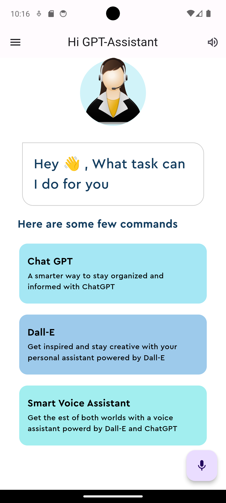

# Voice Assistant with ChatGPT and DALL·E Integration

Welcome to our Flutter-based Voice Assistant application, powered by the ChatGPT API and DALL·E API. This application allows users to interact with a virtual assistant by asking questions and generating images.

## Features

- **ChatGPT Integration**: Engage in natural conversations with the AI-powered chatbot. Ask questions, get answers, and have meaningful dialogues.

- **DALL·E Integration**: Generate creative images by providing text descriptions or prompts to the DALL·E model. Explore the world of AI-generated art.

## Getting Started

Follow these steps to set up and run the application locally.

### Prerequisites

- [Flutter](https://flutter.dev/docs/get-started/install): Make sure you have Flutter installed on your system.

### Installation

1. Clone this repository:

   ```bash
   git clone https://github.com/Sm69mu/flutte_chatgpt-assistant.git

   cd your-voice-assistant-app

   flutter pub get



## Contributing

We welcome contributions from the community! Feel free to open issues, submit pull requests, or provide feedback.


